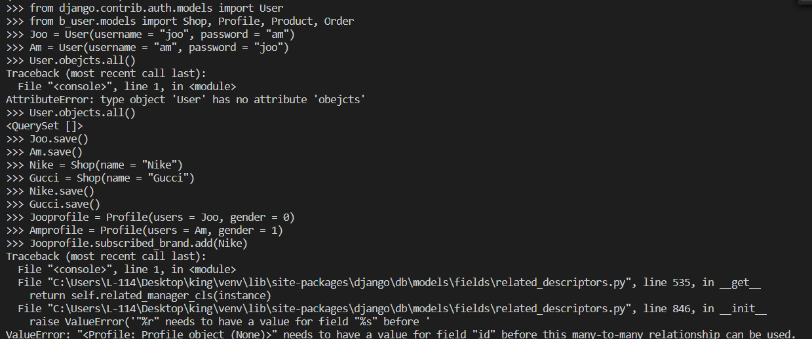
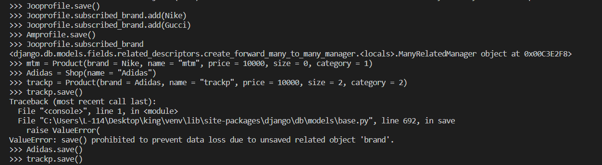
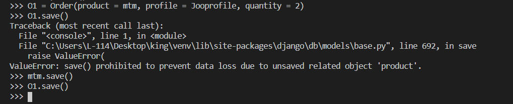

# Django -0

### ***Relation***
**1. OneToOne Relation**

일대일 관계는 객체간의 연결이 말 그대로 일대일인 상황을 말한다. 예를 들어 고객과 신상정보가 각각의 클래스로 존재한다면  
서로 하나씩 밖에 대응할 수 없기 때문에 이것은 일대일의 관계를 가지게 된다. 새로운 클래스를 만들어 데이터베이스에 정보를  
추가하고 싶을 때 이용한다.

**2. ManyToOne Relation**

다대일 관계는 ForeignKey 필드를 이용해 손쉽게 구현할 수 있다. 한명의 판매자가 여러 개의 상품을 판매하듯이 하나의 객체가  
여러 객체와 연결될 필요가 있을 때 사용한다.

    class Seller(models.Model):
        name = CharField(max_length=32)
    
    class Product(models.Model):
        seller = ForeignKey(
            Seller,
            on_delete = CASCADE,
            verbose_name = "판매자"
        )
        price = IntegerField()

만약 상위 객체를 저장하지 않고 하위 객체를 만든다면 오류가 발생하게 된다.

**3. ManyToMany Relation**

다대다 관계는 ManyToMany 필드를 이용해 프로그래밍한다. 교수와 학생의 관계처럼 서로 여러 개의 객체를 참조하는 경우에 사용한다.

    class Professor(models.Model):
        name = CharField(max_length=32)
        major = CharField(max_length=32)
    
    class Student(models.Model):
        name = CharField(max_length=32)
        professor = ManyToManyField(
            Professor
        )

다대다 관계일 경우 MTM 필드를 한 클래스에만 설정해줘야 한다. 프로그래머의 의도가 잘 드러난 곳에 설정해주면 좋다.

*****

**모델링 기록**

가상의 온라인 편집샵을 모델링 했다. 판매자(Shop), 고객(User, Profile), 상품(Product), 그리고 주문(Order) 클래스를 만들었다.

고객과 프로필의 관계는 일대일이다. 하나의 고객과 하나의 프로필이 서로 매칭되는 형태이다. 장고에서 기본으로 제공하는 유저 모델에 프로필 클래스를 일대일 관계로 추가해 기본 유저모델을 확장시켰다. 프로필은 고객의 성별, 즐겨찾는 브랜드 등 추가적인 요소를 나타낼 수 있다.

    class Profile(models.Model):
        GENDER_CHOICES = (
            (0, "Male"),
            (1, "Female")
        )
        users = models.OneToOneField(
            User,
            on_delete = models.CASCADE,
        )
        gender = models.IntegerField("성별", choices=GENDER_CHOICES)
        subscribed_brand = models.ManyToManyField(
            Shop,
            blank = True
        )

즐겨찾기 브랜드는 없을 수도 있기 때문에 blank를 허용했다.

상품과 판매자는 다대일 관계로 설계했다. 하나의 판매자는 여러 상품을 올릴 수 있기 때문에 이 경우 다대일 관계를 쓰는 것이 적절할 것 같다.

주문(Order)은 판매자와 상품을 다대일 관계로 설정했다.

**데이터베이스 접근**

첫 유저 인스턴스를 만들고 User.objects.all()을 하면 보이지 않는다. save() 명령을 하지 않았기 때문이다.  
Jooprofile에서 즐겨찾기 브랜드에 Nike를 추가할 때 오류가 발생하는데, 서로가 서로를 참조하는 ManyToMany필드에서 Jooprofile이 save되지 않아 id가 없기 때문에 오류가 발생한다.

이와 같이 save 명령을 실행하면 정상적으로 작동한다. 마찬가지로 다대일 관계에서도 참조되는 객체가 save되지 않았다면 오류가 발생한다.

